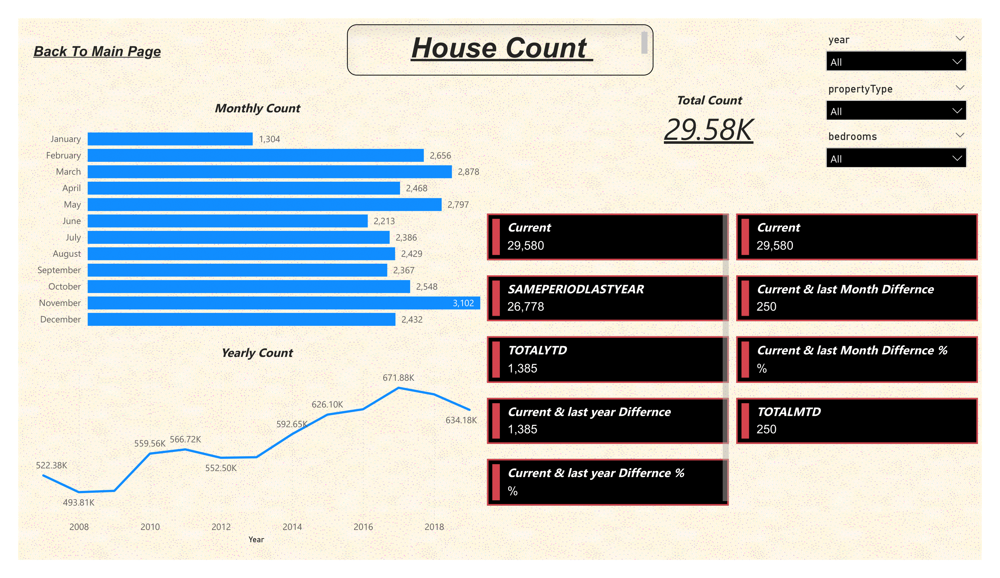
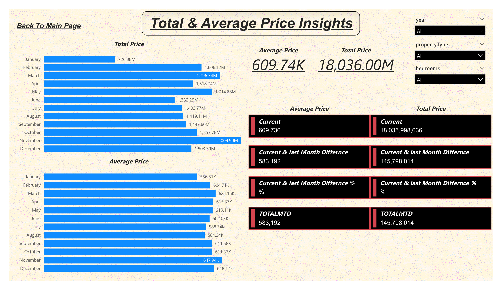

# ***Home Prices Analysis***

## *Overview*
*This project offers an in-depth analysis of Home Prices leveraging **Power BI tools**. Key business metrics and trends are visualized through a comprehensive dashboard. The insights derived facilitate data-driven decision-making, aiding business growth.*

## *To access the project online ,Click on the below link*

[*House_Prices_Analysis_Using_Power_Bi link*](https://app.powerbi.com/view?r=eyJrIjoiMWJmOTM1ZDEtYTYwYS00MGY4LWI2NGItNGI2NzU5MjJhZmM5IiwidCI6IjA5N2I0YWUwLWQwNmEtNGY4Mi1iODBhLTVmYWM1NTZjMDQzNyIsImMiOjl9)

## *Aim*
*The primary goal is to provide actionable insights into the Home Prices, pinpointing areas for enhancement and growth through comprehensive analysis.*

## *Tools Utilized*
* *Microsoft Power BI*

## *1st Report page -General View*

### *1st Report page -General View Insights*
***The max Total prices and Prperties sold count were in 2017*** 

***Prperties with 4 bedrooms has the highest Total Prices while 0 bedroom has the lowest:***

***Prperties with 5 bedrooms has the highest Average Prices while 1 bedroom has the lowest:***

***House Prperties has higher Total Prices and Average Prices that Unit Prperties***

## *2nd Report page -Houses Count*

### *2nd Report page -Houses Count Insights*

***The Total Number Of Properties Sold was 29.58 k*** 

***Yearly basis : The max Prperties sold count were in 2017*** 

***Monthly basis : The max Prperties sold count were in November and Jan Has the lowest*** 

## *3rd Report page -Total & Average Prices*

### *3rd Report page -Total & Average Prices Insights*

***The Total Prices Value was 18.036.00 M***

***The Average Price Over All was 609.47 k***

***Monthly basis : The max Total Prices were in November and Jan Has the lowest*** 

***Monthly basis : The max Average Prices were in November and Jan Has the lowest*** 

## *4th Report page -Ranking*

### *4th Report page -Ranking Insights*

***Different Ranking Pramaeters for categorical features PrpertiesTpe and Bedrooms*** 

## *5th Report page -The Relation between Properties Count and Average Price*

  

### *5th Report page -The Relation between Properties Count and Average Price Insights*

***To Visualizew any outliers (Extreme) Values*** 

## *Conclusion*
This project harnesses Power BI's capabilities to empower stakeholders with a dynamic platform for sales data analysis. The derived insights lead to informed decisions and refined sales strategies.
